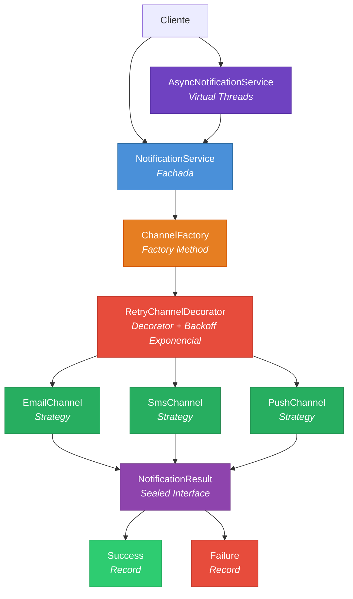

<div align="center">

# Universal Notification Lib

**Librería Java 21 de notificaciones agnóstica al canal**

[](https://openjdk.org/projects/jdk/21/)
[](https://openjdk.org/jeps/444)
[](https://maven.apache.org/)
[](.)
[](LICENSE)

*Envía Email, SMS y Push con una sola interfaz. Cambia de proveedor sin modificar tu código.*

</div>

---

## Tabla de Contenidos

- [Arquitectura](#arquitectura)
- [Características](#características)
- [Quick Start](#quick-start)
- [Uso Avanzado](#uso-avanzado)
- [Docker](#docker)
- [Testing](#testing)
- [Estructura del Proyecto](#estructura-del-proyecto)
- [Uso de IA y Metodología](#uso-de-ia-y-metodología)

---

## Arquitectura

La librería implementa una arquitectura limpia basada en **Strategy**, **Factory**, **Builder** y **Decorator**:



### Patrones de Diseño Aplicados

| Patrón | Dónde | Por qué |
|--------|-------|---------|
| **Strategy** | `NotificationChannel<T>` | Cada canal es intercambiable sin modificar el cliente |
| **Factory Method** | `ChannelFactory` | Centraliza la creación de canales con switch exhaustivo |
| **Builder** | `NotificationConfig` | Configuración fluida e inmutable |
| **Decorator** | `RetryChannelDecorator` | Agrega reintentos **sin modificar** los canales (OCP) |
| **Facade** | `NotificationService` | Punto de entrada único con pattern matching |

---

## Características

| Característica | Detalle |
|----------------|---------|
| **Java 21** | Records, Sealed Interfaces, Pattern Matching, Switch Expressions |
| **Virtual Threads** | `Executors.newVirtualThreadPerTaskExecutor()` -- alta concurrencia con bajo costo de memoria vs platform threads |
| **Reintentos inteligentes** | Backoff exponencial configurable (`baseDelayMs x 2^(intento-1)`) |
| **SOLID estricto** | OCP: los canales nunca se modifican, se decoran |
| **Type-safe** | Sealed interface `NotificationResult` + Records garantizan exhaustividad en compile-time sobre los resultados |
| **Docker-ready** | Multi-stage build con Eclipse Temurin 21 Alpine |
| **Sin Spring Boot** | Cero frameworks pesados, configuración 100% programática |

---

## Quick Start

### 1. Configuración

```java
NotificationConfig config = NotificationConfig.builder()
        .property("email.from", "noreply@tuempresa.com")
        .property("sms.provider", "twilio")
        .retryAttempts(3)
        .baseDelayMs(1000L)
        .build();
```

### 2. Envío síncrono

```java
NotificationService service = new NotificationService(config);

// Email -- el canal se resuelve automaticamente por pattern matching
NotificationResult result = service.send(
        new EmailRequest("usuario@ejemplo.com", "¡Bienvenido!", "Gracias por registrarte."));

// Pattern matching exhaustivo sobre el resultado
String output = switch (result) {
    case NotificationResult.Success s -> "[OK] Enviado: " + s.messageId();
    case NotificationResult.Failure f -> "[FAIL] Error: " + f.reason();
};
```

### 3. Envío con reintentos (Decorator)

```java
// Envolver cualquier canal con reintentos -- SIN modificar el canal original
NotificationChannel<EmailRequest> email = new EmailChannel(config);
NotificationChannel<EmailRequest> resiliente =
        new RetryChannelDecorator<>(email, 3, 1000L);  // 3 reintentos, backoff desde 1s

NotificationResult result = resiliente.send(
        new EmailRequest("admin@empresa.com", "Reporte", "Contenido..."));
```

### 4. Envío asíncrono con Virtual Threads

```java
try (var asyncService = new AsyncNotificationService(config)) {
    CompletableFuture<NotificationResult> future =
            asyncService.sendAsync(new SmsRequest("+506 8888-1234", "Tu código: 482913"));

    // El hilo principal NO se bloquea
    future.thenAccept(r -> System.out.println("Resultado: " + r));
}
```

---

## Uso Avanzado

### ¿Por qué Virtual Threads para notificaciones?

Las notificaciones son operaciones **I/O-bound** (SMTP, HTTP, sockets). Con Virtual Threads:

| Métrica | Platform Threads | Virtual Threads |
|---------|-----------------|-----------------|
| Memoria por hilo | ~1 MB | ~1 KB |
| 10K envíos concurrentes | 10 GB RAM | ~10 MB |
| `Thread.sleep()` | Bloquea el carrier | **Se desmonta**, el carrier queda libre |
| Backoff en reintentos | Costoso | **Gratis** |

### Backoff Exponencial

```
Intento 1: espera  1000 ms  (1s)   -- 1000 x 2^0
Intento 2: espera  2000 ms  (2s)   -- 1000 x 2^1
Intento 3: espera  4000 ms  (4s)   -- 1000 x 2^2
Formula:   baseDelayMs x 2^(intento-1)
```

---

## Docker

### Build y ejecución

```bash
# Construir la imagen
docker build -t universal-notification-lib .

# Ejecutar la demo
docker run --rm universal-notification-lib
```

### Multi-Stage Build

```
Etapa 1 (build):   eclipse-temurin:21-jdk-alpine  -> compila con Maven
Etapa 2 (runtime): eclipse-temurin:21-jre-alpine   -> ejecuta solo el JAR
```

---

## Testing

```bash
# Ejecutar todos los tests
./mvnw test
```

```
Tests run: 47, Failures: 0, Errors: 0, Skipped: 0
BUILD SUCCESS
```

### Cobertura de tests

| Suite | Tests | Qué verifica |
|-------|-------|-------------|
| `EmailChannelTest` | 2 | Canal email (Strategy) |
| `SmsChannelTest` | 2 | Canal SMS (Strategy) |
| `PushChannelTest` | 2 | Canal push (Strategy) |
| `NotificationResultTest` | 5 | Sealed interface + Records |
| `NotificationServiceTest` | 6 | Fachada + pattern matching |
| `ChannelFactoryTest` | 8 | Factory + switch exhaustivo |
| `EmailRequestTest` | 6 | Validación de Record |
| `SmsRequestTest` | 4 | Validación de Record |
| `PushRequestTest` | 5 | Validación de Record |
| `RetryChannelDecoratorTest` | 4 | Reintentos + backoff exponencial |
| `AsyncNotificationServiceTest` | 3 | Virtual Threads + CompletableFuture |

---

## Estructura del Proyecto

```
src/main/java/com/novacomp/notification/
+-- channel/
|   +-- EmailChannel.java          # Strategy -- Email
|   +-- SmsChannel.java            # Strategy -- SMS
|   +-- PushChannel.java           # Strategy -- Push
+-- config/
|   +-- NotificationConfig.java    # Builder -- Configuracion inmutable
+-- core/
|   +-- NotificationChannel.java   # Interfaz Strategy
|   +-- NotificationResult.java    # Sealed Interface (Success | Failure)
|   +-- NotificationService.java   # Fachada con pattern matching
|   +-- AsyncNotificationService.java  # Virtual Threads
+-- demo/
|   +-- DemoApp.java               # Aplicacion de demostracion
+-- factory/
|   +-- ChannelFactory.java        # Factory Method
+-- model/
|   +-- ChannelType.java           # Enum (EMAIL, SMS, PUSH)
|   +-- EmailRequest.java          # Record (Value Object)
|   +-- SmsRequest.java            # Record (Value Object)
|   +-- PushRequest.java           # Record (Value Object)
+-- resilience/
    +-- RetryChannelDecorator.java  # Decorator -- Reintentos + Backoff
```

---

## Proveedores Soportados

La arquitectura **Strategy** permite intercambiar proveedores sin modificar el código del cliente. Actualmente, la librería incluye implementaciones stub (simuladas) que reflejan la estructura y formato de respuesta de proveedores reales:

| Canal | Proveedor | Clase | Estado | Datos simulados |
|-------|-----------|-------|--------|-----------------|
| **Email** | SendGrid | `EmailChannel` | Stub | HTTP 202, `X-Message-Id`, formato JSON de respuesta |
| **Email** | Mailgun | *(extensible)* | Planificado | Agregar `MailgunEmailChannel` implementando `NotificationChannel<EmailRequest>` |
| **SMS** | Twilio | `SmsChannel` | Stub | SID `SM` + hex, status `queued`, formato E.164 |
| **SMS** | Vonage | *(extensible)* | Planificado | Agregar `VonageSmsChannel` implementando `NotificationChannel<SmsRequest>` |
| **Push** | Firebase (FCM) | `PushChannel` | Stub | ID `projects/*/messages/*`, TTL, priority `high` |
| **Push** | APNs | *(extensible)* | Planificado | Agregar `ApnsPushChannel` implementando `NotificationChannel<PushRequest>` |

### Agregar un nuevo proveedor

```java
// 1. Crear la clase implementando la interfaz Strategy
public final class SendGridEmailChannel implements NotificationChannel<EmailRequest> {

    @Override
    public NotificationResult send(EmailRequest request) {
        // Integración real con SendGrid v3 API
        // POST https://api.sendgrid.com/v3/mail/send
        // Headers: Authorization: Bearer ${apiKey}
    }

    @Override
    public ChannelType getType() { return ChannelType.EMAIL; }
}

// 2. Registrar en ChannelFactory (o usar directamente)
NotificationChannel<EmailRequest> channel = new SendGridEmailChannel(config);
```

---

## API Reference

### Clases Principales

#### `NotificationConfig` -- Configuración inmutable

```java
// Construcción con Builder (único punto de configuración)
NotificationConfig config = NotificationConfig.builder()
        .property("email.from", "noreply@empresa.com")  // credenciales / settings
        .property("sms.provider", "twilio")
        .property("sms.account.sid", System.getenv("TWILIO_SID"))
        .retryAttempts(3)            // reintentos globales
        .baseDelayMs(1000L)          // backoff base
        .build();
```

| Método | Retorno | Descripción |
|--------|---------|-------------|
| `getProperty(key)` | `String` | Obtiene una propiedad; retorna `null` si no existe |
| `getProperty(key, default)` | `String` | Obtiene una propiedad con valor por defecto |
| `getRetryAttempts()` | `int` | Número de reintentos configurados |
| `getBaseDelayMs()` | `long` | Delay base para backoff exponencial |
| `getAllProperties()` | `Map<String,String>` | Vista inmutable de todas las propiedades |

#### `NotificationService` -- Fachada síncrona

| Método | Retorno | Descripción |
|--------|---------|-------------|
| `send(Object request)` | `NotificationResult` | Auto-resuelve el canal por pattern matching |
| `send(ChannelType, Object)` | `NotificationResult` | Envía por canal explícito |

#### `AsyncNotificationService` -- Fachada asíncrona (Virtual Threads)

| Método | Retorno | Descripción |
|--------|---------|-------------|
| `sendAsync(Object request)` | `CompletableFuture<NotificationResult>` | Envío no-bloqueante |
| `sendAsync(ChannelType, Object)` | `CompletableFuture<NotificationResult>` | Envío por canal explícito |
| `close()` | `void` | Cierra el executor (implementa `AutoCloseable`) |

#### `NotificationResult` -- Sealed Interface

```java
// Pattern matching exhaustivo (Java 21)
String output = switch (result) {
    case NotificationResult.Success s -> "ID: " + s.messageId() + " at " + s.timestamp();
    case NotificationResult.Failure f -> "Error [" + f.code() + "]: " + f.reason();
};
```

#### `NotificationChannel<T>` -- Interfaz Strategy

| Método | Retorno | Descripción |
|--------|---------|-------------|
| `send(T request)` | `NotificationResult` | Envía la notificación |
| `getType()` | `ChannelType` | Retorna el tipo de canal |

#### `RetryChannelDecorator<T>` -- Decorator

```java
// Envolver cualquier canal con reintentos + backoff exponencial
var resiliente = new RetryChannelDecorator<>(canal, maxRetries, baseDelayMs);
```

### Modelos (Records)

| Record | Campos | Validaciones |
|--------|--------|--------------|
| `EmailRequest` | `to`, `subject`, `body` | `to` no nulo ni vacío |
| `SmsRequest` | `phoneNumber`, `message` | `phoneNumber` no nulo ni vacío |
| `PushRequest` | `deviceToken`, `title`, `body` | `deviceToken` no nulo ni vacío |

---

## Seguridad

### Mejores Prácticas para Credenciales

La librería fue disenada con seguridad en mente. Aquí las mejores prácticas recomendadas:

#### 1. Variables de entorno (recomendado)

```java
// NUNCA hardcodear credenciales en el código fuente
NotificationConfig config = NotificationConfig.builder()
        .property("sendgrid.api.key", System.getenv("SENDGRID_API_KEY"))
        .property("twilio.account.sid", System.getenv("TWILIO_ACCOUNT_SID"))
        .property("twilio.auth.token", System.getenv("TWILIO_AUTH_TOKEN"))
        .property("fcm.server.key", System.getenv("FCM_SERVER_KEY"))
        .build();
```

#### 2. Configuración inmutable

`NotificationConfig` es **inmutable por diseño** -- una vez construida, no se puede modificar. Esto previene:

- Inyección de credenciales en runtime
- Race conditions en entornos multi-hilo
- Modificación accidental de configuración

#### 3. No logging de secrets

Los canales solo logean datos operacionales (destinatario, messageId), **nunca** credenciales ni tokens de autenticación.

#### 4. Scope mínimo en Docker

```dockerfile
# El Dockerfile usa JRE (no JDK) y Alpine para reducir la superficie de ataque
FROM eclipse-temurin:21-jre-alpine AS runtime
```

#### 5. Recomendaciones adicionales

| Práctica | Descripción |
|----------|-------------|
| **Rotación de keys** | Rotar API keys periódicamente; la config programática facilita inyectar nuevas keys sin redeploy |
| **Secrets manager** | En producción, usar AWS Secrets Manager, HashiCorp Vault o equivalente |
| **`.gitignore`** | Nunca commitear archivos `.env` o de configuración con credenciales |
| **Principio de menor privilegio** | Configurar API keys con permisos mínimos en cada proveedor |

---

## Uso de IA y Metodología

Para este proyecto, he utilizado **Claude Opus 4.6 (vía Antigravity)**  como herramienta de soporte (*AI-Assisted Development*) para maximizar la eficiencia y acelerar la escritura de código repetitivo (boilerplate), permitiéndome enfocar el tiempo en la lógica de negocio y la robustez arquitectónica.

### Desglose de Responsabilidades

1. **Arquitectura y Core (Autoría Técnica):**
    - **Diseño:** Definí la arquitectura basada en **Clean Architecture** y patrones de diseño (Strategy, Factory, Decorator) antes de escribir la primera línea de código.
    - **Implementación:** Codifiqué la lógica central del sistema, seleccionando explícitamente **Java 21** para utilizar características avanzadas como *Virtual Threads* y *Records*. La IA se utilizó únicamente para generar el *boilerplate* repetitivo de las clases de configuración.

2. **Implementación y Aceleración (Híbrido):**
    - **Lógica de Negocio:** Estructuré las interfaces selladas (`NotificationResult`) y los contratos del servicio. Utilicé la IA para acelerar la implementación mecánica de los patrones (ej: generar la clase decoradora en base a la interfaz que yo definí).
    - **Testing (TDD):** Diseñé los casos de prueba críticos (éxito, fallo, reintentos) y utilicé la IA para generar el código de los mocks y aserciones repetitivas con Mockito y JUnit 5.

3. **Testing y Calidad (TDD):**
    - **Estrategia:** Diseñé la suite de pruebas unitarias siguiendo TDD (Test Driven Development).
    - **Ejecución:** Escribí los casos de prueba críticos para validar la resiliencia y la concurrencia. Utilicé la IA para acelerar la generación de los *mocks* de Mockito y las aserciones estándar, revisando y ajustando cada test generado para garantizar una cobertura real.

4. **Documentación y Entrega:**
    - **Estándares de Código:** Escribí el código siguiendo estándares internacionales (Naming Conventions).
    - **Contenido:** Redacté la documentación técnica y los mensajes de log directamente en **Español**, priorizando la claridad conceptual y arquitectónica para facilitar la revisión por parte del equipo evaluador.
    - **Formato y Estándares:** Utilicé la IA para generar automáticamente la estructura sintáctica de los comentarios Javadoc (`/** ... */`) y el boilerplate de los archivos, permitiéndome enfocar el esfuerzo en la calidad de las explicaciones funcionales y no en el formato del texto.
